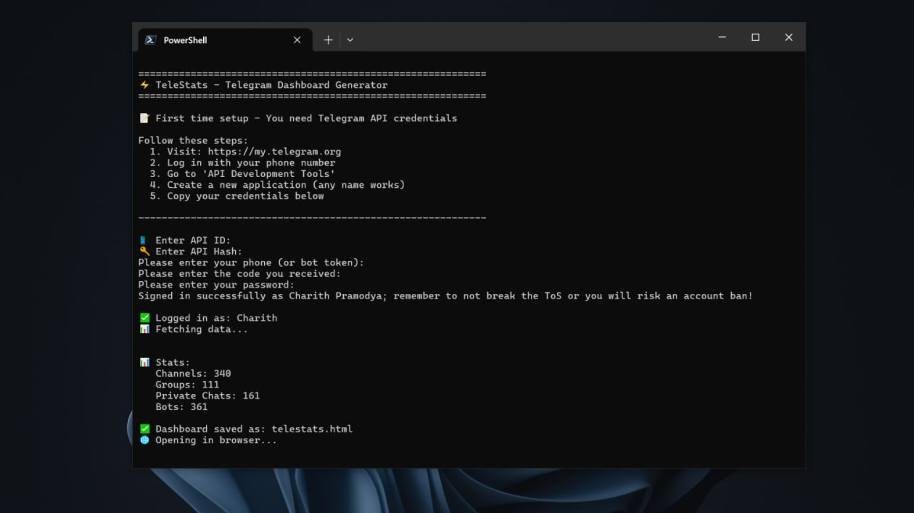

<div align="center">

# TeleStats

**A beautiful, minimal dashboard to visualize your Telegram universe.**



</div>

---

## 🚀 Quick Start

### Method 1: With Environment Variables

**Linux/macOS:**
```bash
pip install telethon -q && TG_API_ID=your_id TG_API_HASH=your_hash curl -sL https://raw.githubusercontent.com/thechariith/telestats/main/telestats.py | python3
```

**Windows PowerShell:**
```powershell
pip install telethon -q; $env:TG_API_ID='your_id'; $env:TG_API_HASH='your_hash'; irm https://raw.githubusercontent.com/thechariith/telestats/main/telestats.py | python
```

### Method 2: Download and Run

**Linux/macOS:**
```bash
pip install telethon -q && curl -O https://raw.githubusercontent.com/thechariith/telestats/main/telestats.py && python3 telestats.py
```

**Windows PowerShell:**
```powershell
pip install telethon -q; irm https://raw.githubusercontent.com/thechariith/telestats/main/telestats.py -OutFile telestats.py; python telestats.py
```

---

## 🔑 Getting API Credentials

1. Visit [my.telegram.org](https://my.telegram.org)
2. Log in with your phone number
3. Click **API Development Tools**
4. Create a new application (any name works)
5. Copy your `api_id` and `api_hash`

---

## ✨ Features

- 📊 **Overview Stats** — See total counts at a glance
- 🔍 **Search** — Quickly find any chat
- 🔗 **Direct Links** — Open any chat in Telegram instantly
- 📱 **Responsive** — Works on desktop and mobile
- 🎨 **Minimal Design** — Clean, distraction-free interface
- ⚡ **Fast** — Generates in seconds
- 🔒 **Private** — Runs locally, no data sent anywhere

---

## 🛠️ Requirements

- Python 3.7+
- Telethon

---

<div align="center">

Made with 💜 and too much ☕ by **TheCHARITH**

</div>
